# How to create "Tileset" with Mapbox Studio?

## Overview

Understanding the difference between tileset and dataset is the first step to work through the Mapbox products.
With this article, you can get the better understanding of
- What is tileset and dataset?
- How to use it
- Operational flow in Mapbox Studio
- Which one is better for your usecases

## What is tileset and dataset?

### tileset

tileset is a collection of raster or vector data, broken up into a uniform grid of square tiles at 22 preset zoom levels(level 0 is lowest/fully zoom-out, level 22 is the highest/fully zoom-in).

Tiles can be ether raster or vector.

- Vector: contain geometries(geographic, geometric) and metadata, rendered only when requested by a client(browser/mobile apps). (i.e. Mapbox Streets, Mapbox Terrain, ..)
- Raster: a collection of images, at various zoom level.  (i.e. Mapbox Satellite style)

#### *how to use tileset with Mapbox*

In Mapbox libraries and SDKs, tilesets are necessary to make maps visible on mobile devices or in the browser.
And they are cacheable and load quickly, Mapbox relies heavily on tilesets to keep our maps performant.

### dataset

dataset is an editable collection of GeoJSON feature,
can be edited on a feature-by-feature basis.

#### *how to use dataset with Mapbox*

It is not intended to be used directly in a Mapbox Studio style, but they can be exported as a tileset or you can request a list of features to be used any way you would use GeoJSON.
Any dataset exported to a tileset can be added as a layer in the Mapbox Studio style editor.

Datasets can be uploaded to Mapbox using Mapbox Studio or the Mapbox Datasets API, and can be edited in the Mapbox Studio dataset editor.

### tileset vs dataset

*datasets:* provide access to feature geometries(points, lines, and polygons) and properties(attributes), both of which can be edited in Mapbox studio dataset editor or through the Mapbox Datasets API.
Once your dataset has been created, it will need to be published into a tileset.

*tilesets:* lightweight collections of vector data that are optimized for rendering and are not editable but can be styled in Mapbox Studio style editor. if data is enough large and not updated often, uploading your data as a tileset.

### Quickstart: Let's create "Tileset" with Mapbox Studio

To upload your dataset/tileset in Mapbox Studio, go to `Tileset` tab, then click `New Tileset`, then upload your data.
data will be rendered as vector tiles from your data.
In this case, target "data" is dataset, which can be uploaded(case I) or created in dataset editor(case II).

#### Case I. Create Tilesets from sample data.
1. Prepare your data. In this example, you can use sample data of  [GeoJSON](https://docs.mapbox.com/help/glossary/geojson)
2. login to mapbox.com > studio
3. you will show your top page
4. click `Tilesets` tab on right top of the page, then click `New tilesets` 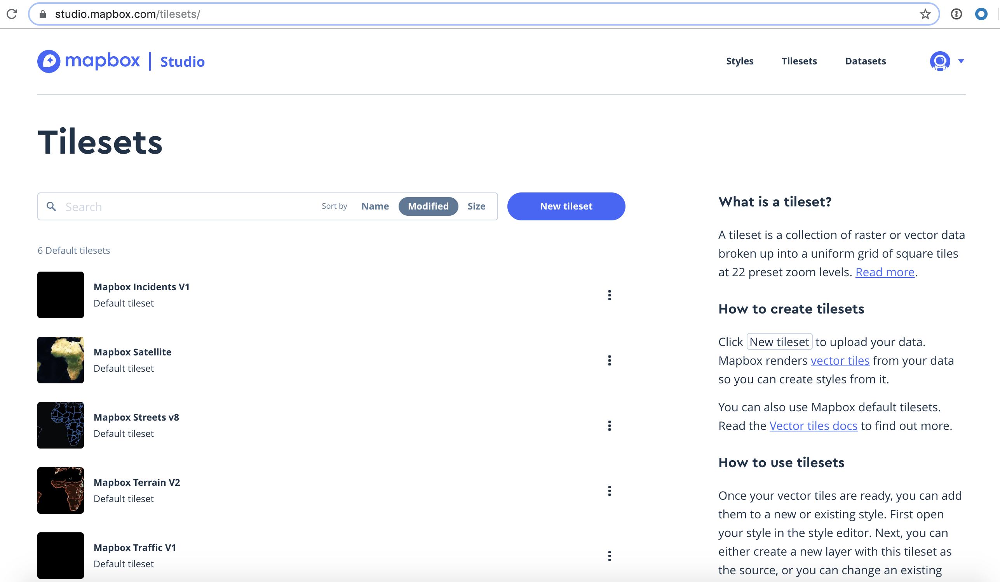
5. click "select a file" 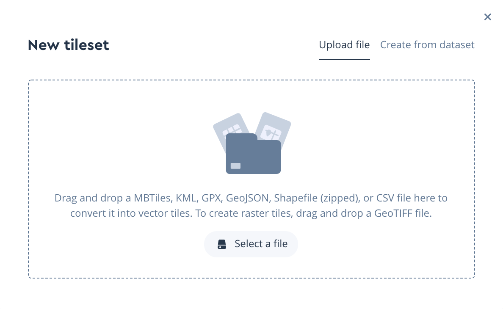, then wait for a seconds...
6. will be find the new tilesets are found in bottom of the page 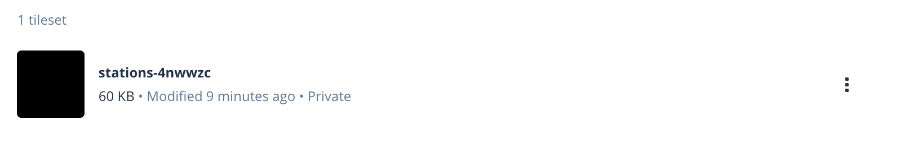
Now you can upload the your data(datasets) as tilesets.

7. Next, click "style", and choose "New Style" 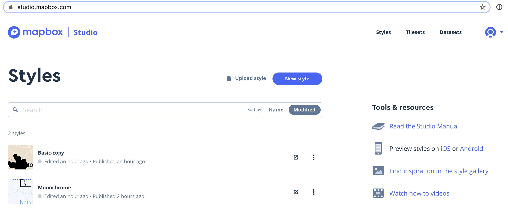
8. this time, you will use "Basic" style, then click "Customize Basic" 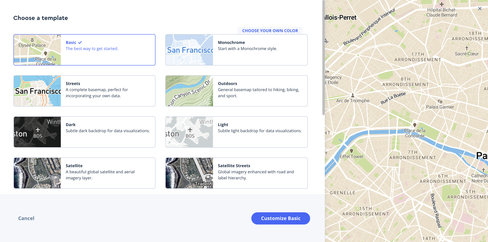
9. After moved to style edit page, push plus button 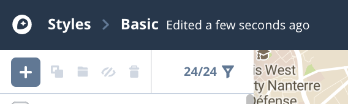
10. choose your tileset and click on the type name (station-xxx) with Circle Type icon 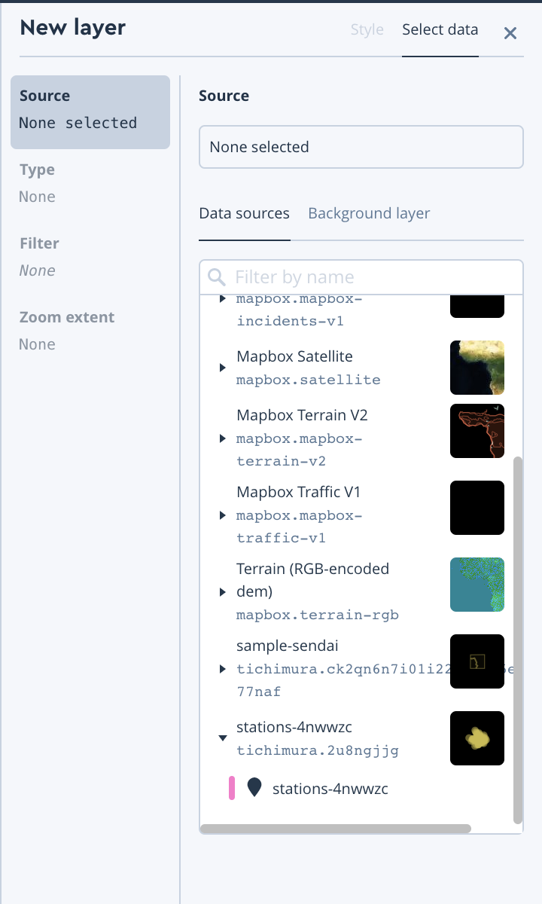
11. select "Style" tab and see it works 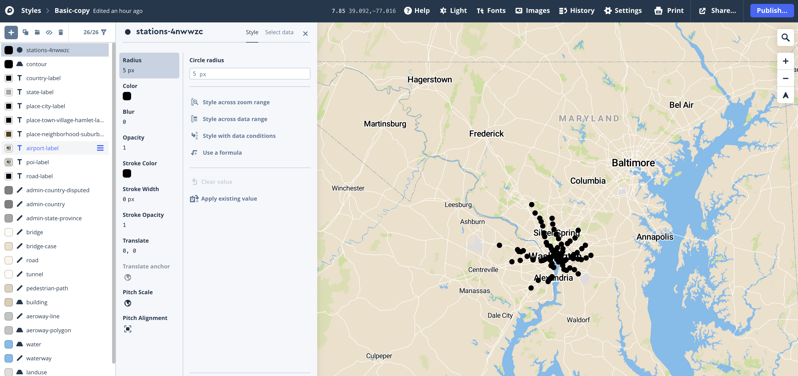
12. push "publish" button on right top page, then saved as your Style

#### Case II. Create Tilesets from scratch

If you have create your own dataset, using `Dataset Editor` is good way to start
1. click `Datasets` tab, on top of the page, then click `New dataset` 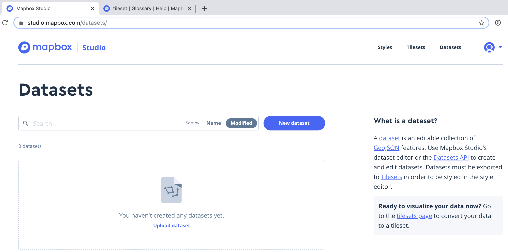
2. select `Blank dataset`, then input name for dataset, then click `create` 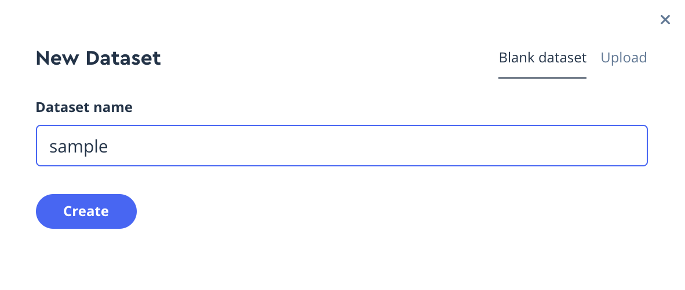
3. blank dataset is now created. 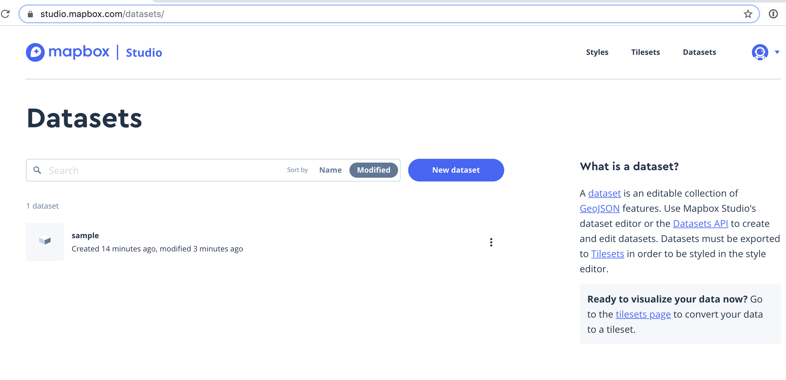
4. click the name, then it will open the dataset editor. 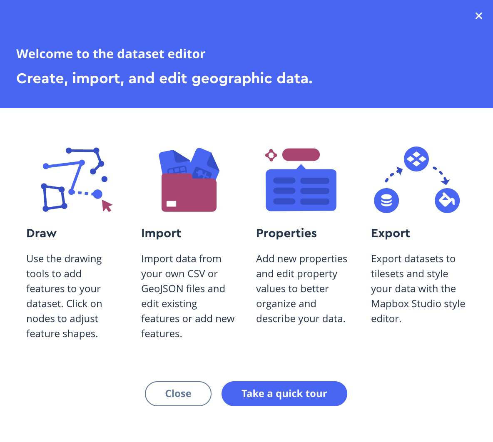
5. you can draw points, line, polygons, just in cases 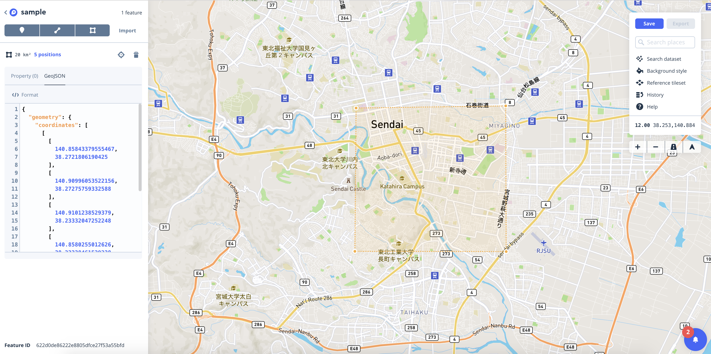
6. push `save` button and finish the editor 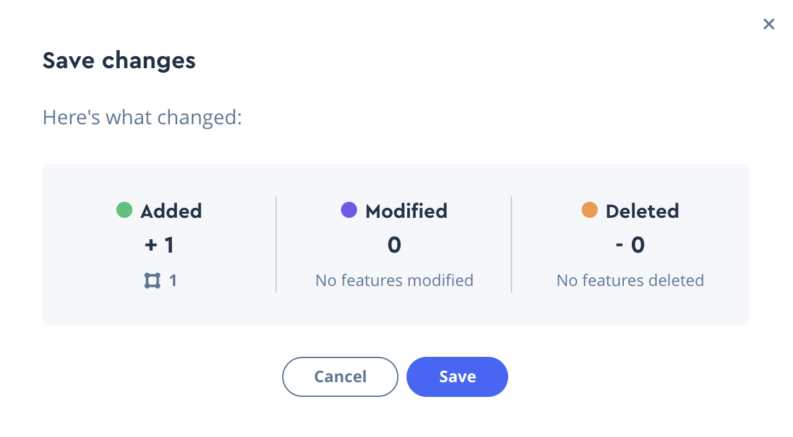
7. click the right side of your dataset, and select `export to tileset` 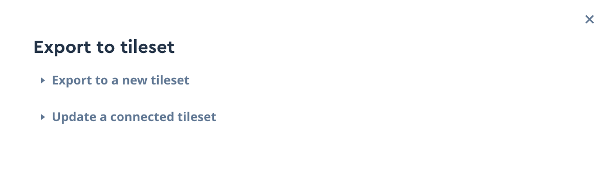
8. you will get the notification of export completion
9. Now, you can see your dataset is connected to the tileset, which is exported from your dataset. 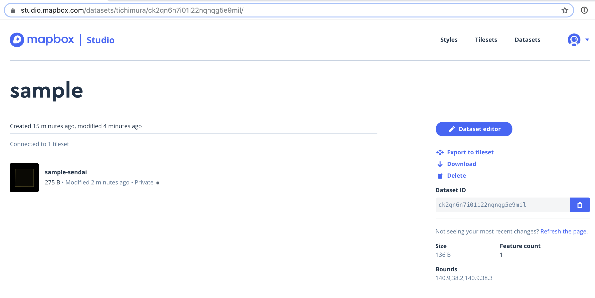

### In summary, which one you should upload?

**datasets are editable, tilesets are styleable**

if you would like to upload data with editable geometric data   
... you should upload `datasets`.  

if you would like to upload data with large size, and not have additional requiement for datasets,  
... you should upload `tileset`.

More information can be found in Studio Manual [https://docs.mapbox.com/studio-manual/overview/](https://docs.mapbox.com/studio-manual/overview/)

### Reference

- Our map data [https://docs.mapbox.com/help/how-mapbox-works/mapbox-data/](https://docs.mapbox.com/help/how-mapbox-works/mapbox-data/)

- Upload data [https://docs.mapbox.com/help/how-mapbox-works/uploading-data/](https://docs.mapbox.com/help/how-mapbox-works/uploading-data/)

- Glossary: [https://docs.mapbox.com/help/glossary/tileset](https://docs.mapbox.com/help/glossary/tileset)
